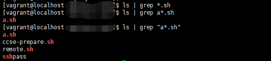

先上图：

直接给原因：Unix bash 会对文件名做展开处理，通常是将`通配符`转换成匹配的文件名称（由globbing进程处理）。

这里的`通配符`与正则表达式又存在区别，比如常用的`*`其实等价于正则里的`.*`（这些通配符组成的集合被称为glob patterns）。

所以上面的`*.sh` 其实被展开为 a.sh ccse-prepare.sh remote.sh，所以`grep *.sh`没有任何输出。

同理，`a*.sh`在当前目录下只能展开为`a.sh`，所以`grep a*.sh`其实就是执行 `grep a.sh`，能够看到，输出的也只有`a.sh`

最后，使用引号，则是表示将这段内容作为一个字符串，不会对其进行展开处理，即`a*.sh`作为参数传入grep，grep进行正则匹配，输出了对应结果。

在实际实践中，通过shell对文件做一些处理时可能会因为globbing的存在导致一些问题，比如：

> arr=(${files//,/ })  # files是用户要查找的文件名，以逗号分隔，可包含通配符。

得到的结果，会直接将所有通配符展开。举个例子：

如果`files="*.sh,a.sh"`，最终arr中得到的结果是：`a.sh ccse-prepare.sh remote.sh a.sh`，`*.sh`被展开了。导致最终的arr中没法拿到用户的原始输入。

可以使用 set -f 关闭展开处理。 对应的 set +f 就是开启该功能。

