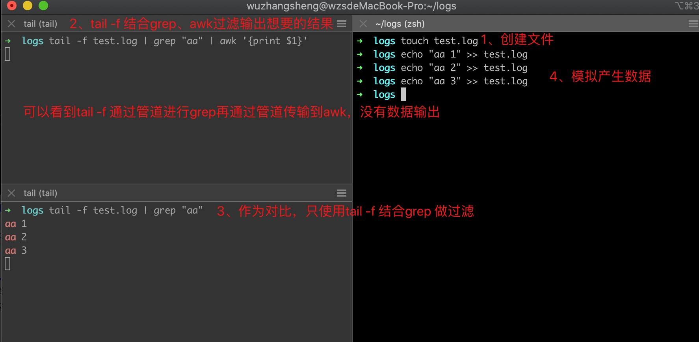
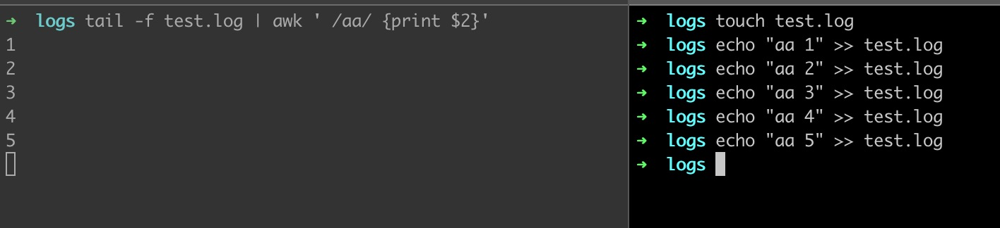

### 现象：

### 原因：
非交互方式使用大部分命令时（包括grep），都会对输出进行缓存，这也就意味着输出不会立即写入到stdout，而是在缓冲区（大小通常是4KB）满了或者输入关闭了才会输出。

上图中`tail -f`命令作为`grep`的输入显然是不会关闭的，并且由于要输出的数据量未超过缓冲区大小，所以`grep`命令不会有输出，后面的`awk`命令也就不会接收到数据。

### 解决办法
`grep`命令有一个 `--line-buffered` 选项，字面意思是使用 line buffer，意味着每满一行都flush一次。

与`grep`类似，`awk`提供了一个`fflush()`方法来完成缓冲区的flush。

除了使用 `--line-buffered` 之外，上述命令还可以简化为单独使用`awk`来完成：

