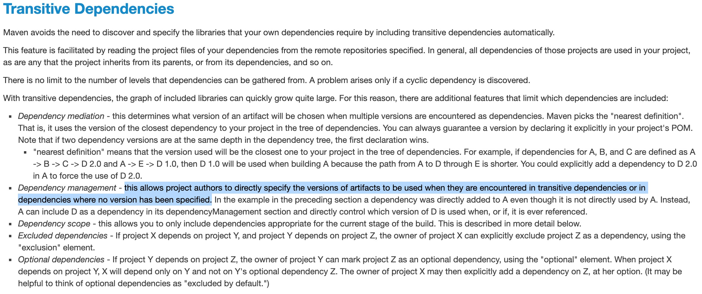

#### maven parent pom 中的dependencyManagement对于传递依赖版本的影响

parent.pom
```xml
...
<dependencyManagement>
    <dependencies>
        <dependency>
            <groupId>com.test</groupId>
            <artifactId>common</artifactId>
            <version>1.0.0</version>
        </dependency>
    </dependencies>
</dependencyManagement>
...
```

A.pom
```xml
...
<parent>
    <groupId>com.test</groupId>
    <artifactId>parent</artifactId>
    <version>1.0.0</version>
</parent>

<dependencies>
    <dependency>
        <groupId>com.test</groupId>
        <artifactId>B</artifactId>
        <version>2.0.0</version>
    </dependency>
</dependencies>
...
```

B.pom
```xml
...
<dependencies>
    <dependency>
        <groupId>com.test</groupId>
        <artifactId>common</artifactId>
        <version>2.0.0</version>
    </dependency>
</dependencies>
...
```

以上的几个工程，依赖结构如下：
```
  ┌────────────┐     dependency      ┌────────────┐ 
  │   parent   │─────Management─────▶│common 1.0.0│ 
  └────────────┘                     └────────────┘ 
         ▲                                          
         │                                          
         │                                          
      parent                                        
         │                                          
         │                                          
         │                                          
 ┌───────────────┐                   ┌─────────────┐
 │       A       │────dependency────▶│      B      │
 └───────────────┘                   └─────────────┘
                                            │       
                                            │       
                                       dependency   
                                            │       
                                            │       
                                            ▼       
                                      ┌────────────┐
                                      │common 2.0.0│
                                      └────────────┘
```

A 最终会依赖到 common，这里的 common 包涉及到了两个版本：
1）A 的 parent pom 中的 dependencyManagement 指定的 common 版本为 1.0.0；\
2）A -> B -> common:2.0.0

最终A依赖的 common 版本为 **1.0.0**。此为 maven 的特性：


图中选中的内容说明了：

`传递依赖的包`以及`在dependency中没有指定version的包`都会使用 dependencyManagement 中的版本。